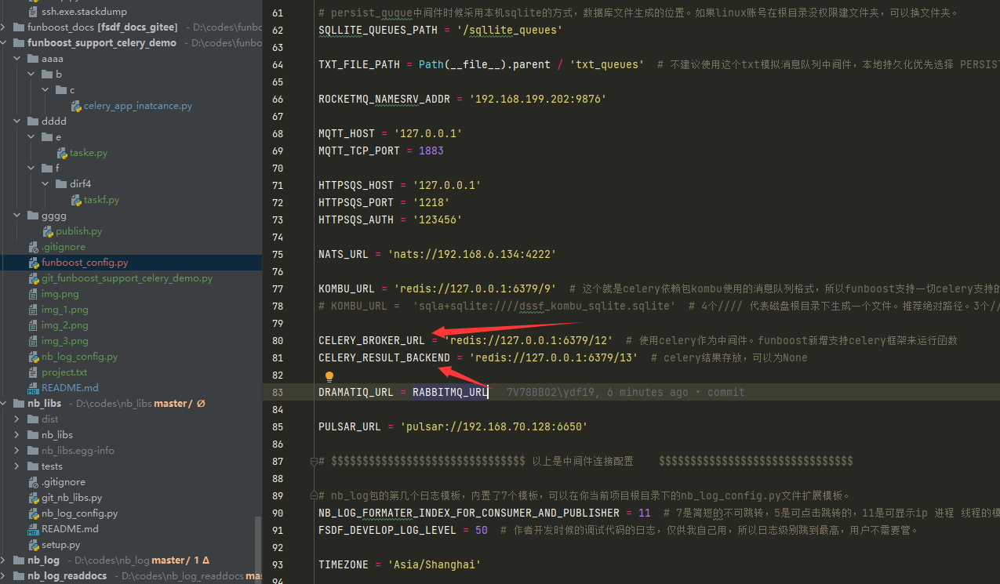
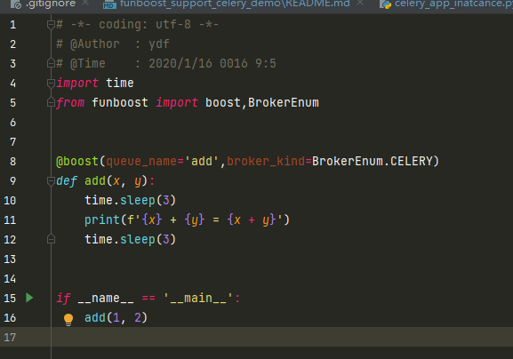
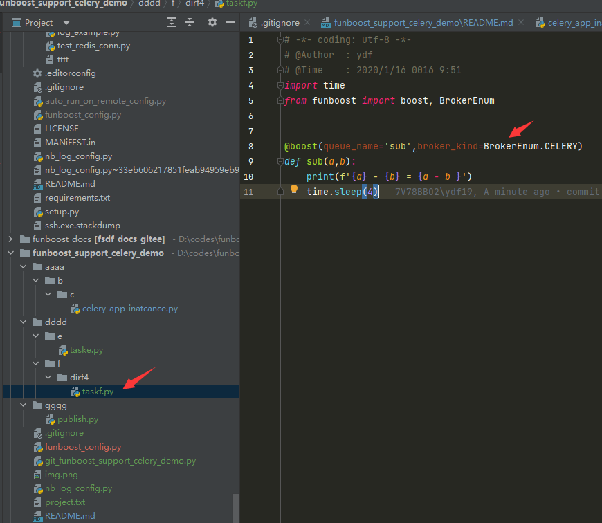
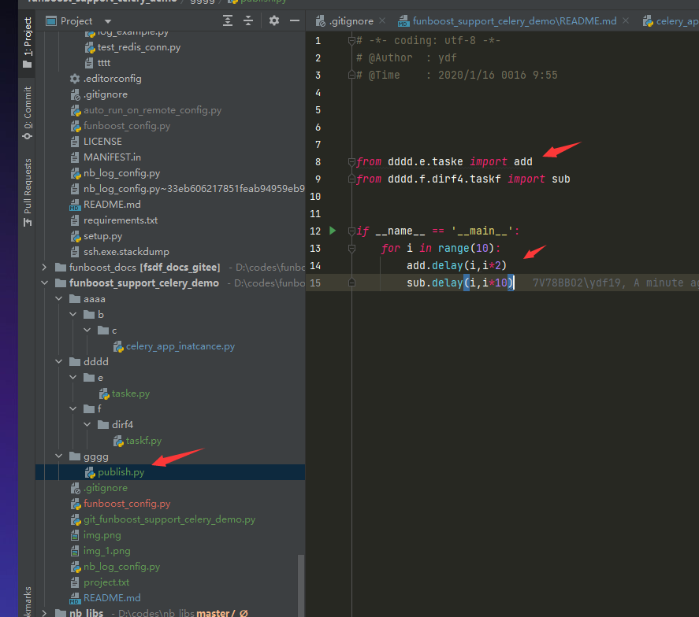
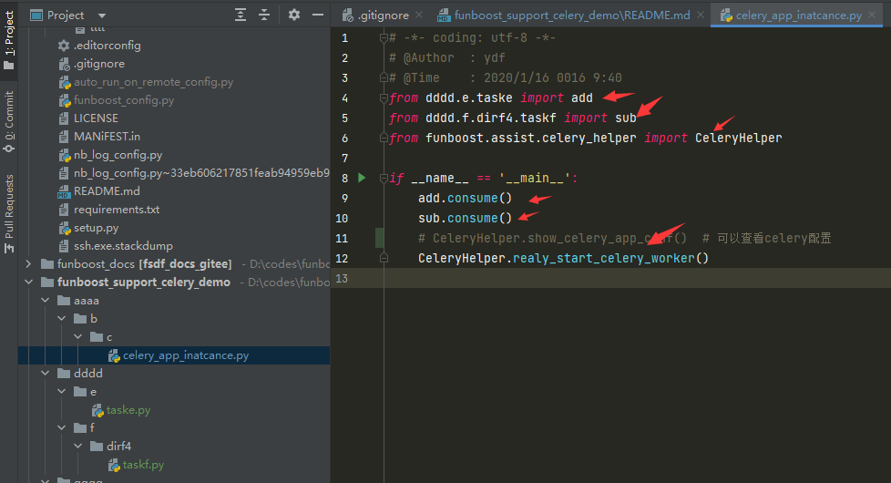

## 演示不规范的celery项目目录结构的funboost操作celery的使用：


```

D:\CODES\FUNBOOST_SUPPORT_CELERY_DEMO
├─.idea
│  └─inspectionProfiles
├─aaaa
│  └─b
│      └─c
├─dddd
│  ├─e
│  │  └─taske.py
│  └─f
│      └─dirf4
│          └─taskf.py
├─gggg
└─publish.py

        
```

## 使用funboost 能 轻松自动化配置和操作celery,用户无需手写配置celery.

funboost_config.py  配置 CELERY_BROKER_URL 的值


dddd/e/taske.py 使用boost装饰器,并设置 broker_kind=BrokerEnum.CELERY


dddd/f/dirf4/taskf.py 使用boost装饰器,并设置 broker_kind=BrokerEnum.CELERY



gggg/publish.py  发布任务,可以使用delay或者push发布任务都可以.



aaaa/b/c/celery_app_inatcance.py  # 启动消费. 相当于你在cmd 敲击了 celery worker 命令行启动了celery消费



```
使用funboost 能轻松配置和操作celery,无视用户的项目目录结构多么复杂和不规则.
```

对比celery操作负责不规则目录,让funboost代为操劳自动使用celery,代码大大简化了.
[https://github.com/ydf0509/celery_demo](https://github.com/ydf0509/celery_demo)


